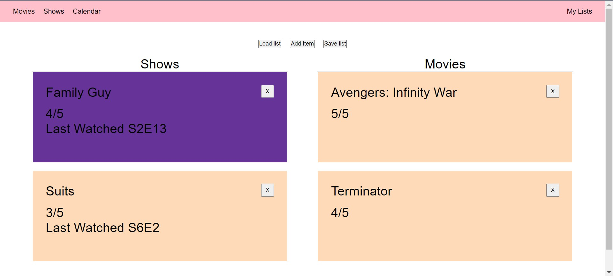

<div align="center">
  <h1>MyTvList</h1>
  
  <p>
    A simple web application to keep track of your shows/movies
  </p>
</div>

<!-- Table of Contents -->

# Table of Contents

-   [About the Project](#about-the-project)
    -   [Motivation](#motivation)
    -   [Tech Stack](#tech-stack)
    -   [Features](#features)
    -   [Environment Variables](#environment-variables)
-   [Getting Started](#getting-started)
    -   [Prerequisites](#prerequisites)
    -   [Installation](#installation)
    -   [Run Locally](#run-locally)
-   [Roadmap](#roadmap)

<!-- About the Project -->

## Motivation

This project was created mainly to teach myself basics of connecting MongoDB to a web application. I avoided spending too much time on the UI/UX, and also choose to not build some features as to focus my learning on interacting with the database.

I watch many TV shows at once (rather than binging) and thought it would be nice to be able to track them. I also have a backlog of movies that I would like to watch, which led me to implement a list to keep track of watched movies as well.

## About the Project

<div align="center"> 
  
</div>

<!-- TechStack -->

### Tech Stack

  <summary>Client</summary>
  <ul>
    <li><a href="https://reactjs.org/">React.js</a></li>
  </ul>

  <summary>Server</summary>
  <ul>
    <li><a href="https://expressjs.com/">Express.js</a></li>
  </ul>
<summary>Database</summary>
  <ul>
    <li><a href="https://www.mongodb.com/">MongoDB</a></li>
    <li><a href="https://mongoosejs.com/">Mongoose</a></li>
  </ul>
<!-- Features -->

### Features

-   Save list onto a MongoDB server
-   Load list from a MongoDB server
-   Add/delete items onto lists

<!-- Env Variables -->

### Environment Variables

Note: The login form is currently purely for aesthetics and does not serve as any type of authentication.

To run this project, you will need to add the following environment variables to your .env file.

`DB_URI` URI for connecting to a MongoDB database

`DB_USER`

`DB_PASSWORD`

<!-- Getting Started -->

## Getting Started

<!-- Prerequisites -->

### Prerequisites

This repository contains both the backend server as well as the frontend web application. Both uses `npm` as package manager

<!-- Installation -->

### Installation

The backend and frontend should be installed separately with npm

```bash
 npm install
```

<!-- Run Locally -->

### Run Locally

Clone the project

```bash
  git clone https://github.com/vintydong/mytvlist.git
```

Go to the corresponding directory

```bash
  cd mytvlist/frontend
  cd mytvlist/backend
```

Install dependencies

```bash
  npm install
```

Start the server

```bash
  cd mytvlist/backend
  node app.js
```

Start the website

```bash
  cd mytvlist/frontend
  npm start
```

<!-- Roadmap -->

## Roadmap

-   [ ] Edit items
-   [ ] Pulling show/movie information from external API
-   [ ] Add catalog of shows/movies
-   [ ] Implement authentication
